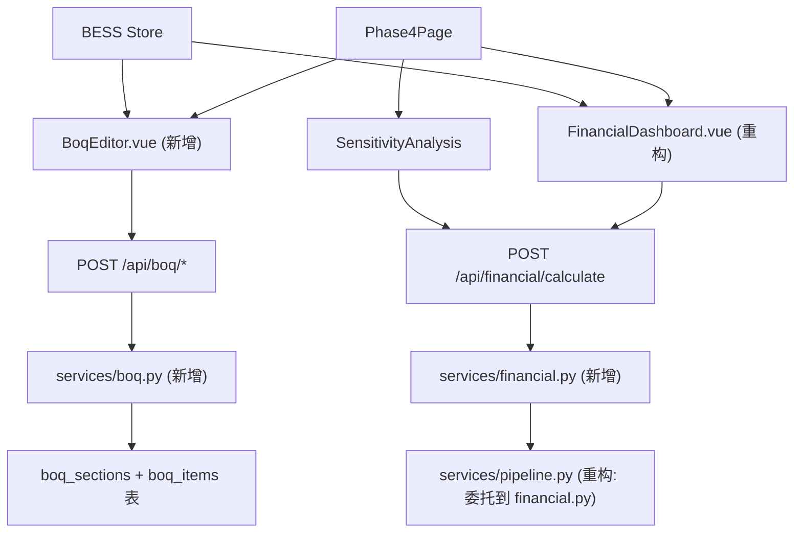
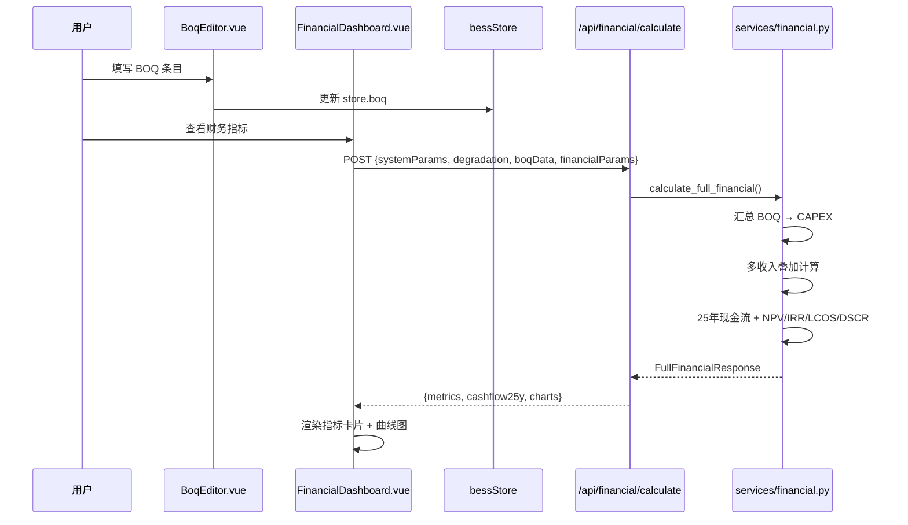

# BESS BOQ 报价模块与财务引擎后端化 — 技术设计

Feature Name: bess-boq-financial-engine
Updated: 2026-06-28

## Description

将财务计算从 Vue 前端 `FinancialDashboard.vue` 迁移至 Python 后端统一引擎，新增 BOQ 工程量清单报价模块，统一内部单位为 MW/MWh/USD。实现"系统设计 → BOQ 报价 → CAPEX 自动汇总 → 多收入财务模型 → 投标指标输出"全链路。

## 设计决策（已确认）

1. **BOQ 编辑器位置**: Phase4Page 中 BOQ 在前 → 自动汇总 CAPEX → 财务计算，符合投标实际流程
2. **数据库迁移**: ALTER TABLE 增量迁移，新增表通过 `create_all()` 自动创建，不删除现有数据
3. **多收入默认**: 所有 5 种收入类型默认启用
4. **前端 BOQ 组件**: 全新 `BoqEditor.vue`，与 BOM 组件职责分离
5. **汇率数据源**: 内嵌固定汇率表 (SAR=3.75, AED=3.6725, CNY=7.24)

## Architecture

### 重构后架构



### 数据流



## Components and Interfaces

### Backend

#### 1. `services/financial.py` — 完整财务计算引擎

```python
def calculate_full_financial(
    total_ac_usable: list[float],  # 25 年可用能量 MWh
    financial_params: dict,         # 收入/成本/融资/税收参数
    boq_data: dict | None           # 可选 BOQ 汇总
) -> dict:
    """返回 FullFinancialResponse"""
```

**内部函数**:
| 函数 | 职责 |
|------|------|
| `_aggregate_boq_to_capex(boq_data)` | BOQ 7 分类汇总为 equipment/epc/development |
| `_calculate_revenue_stack(params, year)` | 多收入叠加（5 种） |
| `_calculate_annual_cashflow(year)` | 单年现金流 = revenue - opex - tax |
| `_calculate_debt_schedule()` | 等额本息/等额本金还款计划 |
| `_calculate_depreciation()` | 15 年直线折旧 |
| `_calculate_metrics(cashflows)` | NPV, IRR, Equity IRR, LCOS, DSCR, payback |

**输入结构**:
```json
{
  "totalAcUsable": [100, 99.2, ...],  // 25 values
  "systemParams": {
    "ratedEnergy": 5,
    "initContainerQty": 10,
    "pcsPower": 50,
    "duration": 2
  },
  "financialParams": {
    "revenue": {
      "arbitrage": {"enabled": true, "offPeakPrice": 30, "peakPrice": 60, "spreadCapture": 85, "operatingDays": 330},
      "capacity": {"enabled": true, "capacityPrice": 45000},
      "ancillary": {"enabled": true, "ancillaryPrice": 15000},
      "ppa": {"enabled": true, "ppaPrice": 55, "escalation": 2.0},
      "capacityAuction": {"enabled": true, "auctionPrice": 120000, "contractYears": 5}
    },
    "opex": {
      "fixedOpexPerMw": 5000,
      "variableOpexPerMwh": 2.5,
      "insuranceRate": 0.5,
      "landLease": 150000
    },
    "financing": {
      "debtRatio": 70,
      "interestRate": 6.5,
      "loanTerm": 15,
      "repaymentType": "equal_installment"
    },
    "tax": {
      "corporateTaxRate": 20,
      "vatRate": 15,
      "taxHolidayYears": 5
    },
    "discountRate": 8.0,
    "depreciationYears": 15,
    "residualRate": 5
  },
  "boqData": {  // 可选, BOQ 编辑器提供
    "battery": {"subtotal": 120000000},
    "pcs": {"subtotal": 25000000},
    ...
  }
}
```

**输出结构** (`FullFinancialResponse`):
```json
{
  "metrics": {
    "projectIrr": 12.34,
    "equityIrr": 18.56,
    "npv": 45000000,
    "lcos": 0.085,
    "dscr": {"min": 1.25, "avg": 1.68},
    "payback": 7,
    "roi": 145.2
  },
  "cashflowTable": [
    {
      "year": 1,
      "revenue": {"arbitrage": 5000000, "capacity": 2250000, ...},
      "totalRevenue": 9500000,
      "opex": 2500000,
      "ebitda": 7000000,
      "depreciation": 3000000,
      "interest": 1050000,
      "taxableIncome": 2950000,
      "tax": 590000,
      "netIncome": 2360000,
      "debtService": 1500000,
      "freeCashflow": 860000,
      "cumulativeCashflow": -19000000
    }
  ],
  "capexBreakdown": {
    "equipment": 120000000,
    "epc": 25000000,
    "development": 15000000
  }
}
```

#### 2. `routes/financial.py` — 财务 API

| 端点 | 方法 | 说明 |
|------|------|------|
| `/api/financial/calculate` | POST | 完整财务计算 |
| `/api/financial/capex-from-boq` | POST | 从 BOQ 汇总 CAPEX（仅汇总，不跑全流程） |

注册为 `financial_bp` Blueprint，在 `app.py` 中注册。

#### 3. `routes/boq.py` — BOQ CRUD API

| 端点 | 方法 | 说明 |
|------|------|------|
| `/api/boq/sections` | GET | 获取 7 个预设分类模板 |
| `/api/boq/items?project_id=X` | GET | 获取项目 BOQ 条目 |
| `/api/boq/items` | POST | 批量保存 BOQ 条目 |
| `/api/boq/version` | POST | 创建报价版本快照 |

#### 4. `services/boq.py` — BOQ 业务逻辑

**BOQ 分类模板** (固定 7 类):
```python
BOQ_CATEGORIES = [
    {"code": "100", "name": "Battery System", "name_zh": "电池系统", "unit": "MWh"},
    {"code": "200", "name": "PCS", "name_zh": "PCS 变流系统", "unit": "MW"},
    {"code": "300", "name": "BOP", "name_zh": "电站配套 BOP", "unit": "lot"},
    {"code": "400", "name": "Civil Works", "name_zh": "土建工程", "unit": "m²"},
    {"code": "500", "name": "Grid Connection", "name_zh": "并网接入", "unit": "lot"},
    {"code": "600", "name": "EMS", "name_zh": "能量管理系统 EMS", "unit": "lot"},
    {"code": "700", "name": "Commissioning & O&M", "name_zh": "调试与运维", "unit": "lot"},
]
```

**BOQ→CAPEX 映射**:
```python
BOQ_TO_CAPEX_MAP = {
    "100": "equipment",  # 电池 → equipment
    "200": "equipment",  # PCS → equipment
    "300": "epc",        # BOP → epc
    "400": "epc",        # 土建 → epc
    "500": "epc",        # 并网 → epc
    "600": "equipment",  # EMS → equipment
    "700": "development",# 调试 → development
}
```

`aggregate_boq_to_capex(boq_items)` 按此映射将各分类 subtotal 聚合为三大 CAPEX 类别。

#### 5. 数据库新增表

```python
class BoqSection(db.Model):
    """BOQ 分类——固定7级模板"""
    __tablename__ = 'boq_sections'
    id = db.Column(db.Integer, primary_key=True)
    code = db.Column(db.String(10), unique=True)
    name = db.Column(db.String(100))
    name_zh = db.Column(db.String(100))
    default_unit = db.Column(db.String(20))
    sort_order = db.Column(db.Integer)


class BoqItem(db.Model):
    """BOQ 条目"""
    __tablename__ = 'boq_items'
    id = db.Column(db.String(36), primary_key=True)
    project_id = db.Column(db.String(36), db.ForeignKey('projects.id'), nullable=False)
    section_code = db.Column(db.String(10))
    seq = db.Column(db.Integer)            # 序号
    name = db.Column(db.String(300))        # 设备/工程名称
    spec = db.Column(db.String(500))        # 规格型号
    unit = db.Column(db.String(20))
    quantity = db.Column(db.Float)
    unit_price = db.Column(db.Float)        # USD
    total_price = db.Column(db.Float)       # 合价 (qty × unit_price)
    note = db.Column(db.String(500))
    is_alternative = db.Column(db.Boolean, default=False)  # Alternative BOQ
    version = db.Column(db.Integer, default=1)
    created_at = db.Column(db.DateTime, default=datetime.utcnow)
    updated_at = db.Column(db.DateTime, default=datetime.utcnow, onupdate=datetime.utcnow)
```

#### 6. 扩展现有表

`FinancialData` 表新增字段：
```python
currency = db.Column(db.String(3), default='USD')
unit_system = db.Column(db.String(10), default='metric')
```

#### 7. Survey 表扩展 (中东化)

`Survey` 表新增字段：
```python
# 电网接入
pcc_voltage = db.Column(db.Float)       # kV
pcc_short_circuit_mva = db.Column(db.Float)  # MVA
grid_code = db.Column(db.String(50))    # SEC/ESMA/GSO/other

# 环境条件
temp_max = db.Column(db.Float)          # °C
temp_min = db.Column(db.Float)          # °C
temp_avg = db.Column(db.Float)          # °C
sand_protection = db.Column(db.String(10))  # IP55/IP65
humidity_cycle = db.Column(db.String(20))   # low/medium/high
```

### Frontend

#### 1. `BoqEditor.vue` — 新增组件

**Props**: 无（通过 `useBessStore()` 读写）

**功能**:
- 按 7 级分类展示 BOQ 条目，每类可折叠
- 支持 Main BOQ / Alternative BOQ 两个 tab 切换
- 每行可编辑：序号、名称、规格、单位、数量、单价、合价(自动)、备注
- 自动从 store.systemParams 预填数量建议值（如 containerQty → 电池系统中集装箱数量）
- 显示 7 类小计和总价
- "汇总到 CAPEX" 按钮 → 自动写入 store.financial.capex

#### 2. `FinancialDashboard.vue` — 重构

**移除**:
- `computeAll()` 函数及所有前端计算逻辑
- CAPEX/OPEX 输入表单（移至 BoqEditor 或新建 FinancialParams.vue）
- 局部 `f` reactive 对象

**保留**:
- 指标卡片渲染
- ECharts 图表渲染（现金流 S 曲线、收入堆叠、DSCR 趋势、CAPEX 饼图）

**新增**:
- `fetchFinancialResults()` — 调用 `POST /api/financial/calculate`
- 收入模型启用/禁用开关（5 种收入类型）
- 结果加载状态和错误提示

#### 3. `stores/bess.js` — 扩展

```js
state: () => ({
  // ... existing ...
  boq: {
    items: [],          // BoqItem[]
    activeVersion: 'main', // 'main' | 'alternative'
    totalPrice: 0,
  },
  financial: {
    capex: { equipment: 0, epc: 0, development: 0 },  // 新增 currency 字段
    opex: { maintenance: 0, insurance: 0, grid: 0, landLease: 0 },
    revenue: {
      arbitrage: { enabled: true, offPeakPrice: 30, peakPrice: 60, spreadCapture: 85, operatingDays: 330 },
      capacity: { enabled: true, capacityPrice: 45000 },
      ancillary: { enabled: true, ancillaryPrice: 15000 },
      ppa: { enabled: true, ppaPrice: 55, escalation: 2.0 },
      capacityAuction: { enabled: true, auctionPrice: 120000, contractYears: 5 },
    },
    financing: { debtRatio: 70, interestRate: 6.5, loanTerm: 15, repaymentType: 'equal_installment' },
    tax: { corporateTaxRate: 20, vatRate: 15, taxHolidayYears: 5 },
    discountRate: 8.0,
    depreciationYears: 15,
    residualRate: 5,
    metrics: { projectIrr: 0, equityIrr: 0, npv: 0, lcos: 0, dscr: { min: 0, avg: 0 }, payback: -1, roi: 0 },
    cashflowTable: [],
    capexBreakdown: { equipment: 0, epc: 0, development: 0 },
    calculating: false,
  },
})
```

#### 4. `src/utils/units.js` — 新增工具模块

```js
export const EXCHANGE_RATES = { USD: 1, SAR: 3.75, AED: 3.6725, CNY: 7.24 }

export function toInternal(value, unit) { ... }     // → USD / MW / MWh
export function toDisplay(value, unit, currency) { ... }  // → SAR / AED / CNY
```

## Data Models

### BOQ Item 数据结构

```typescript
interface BoqItem {
  id: string
  projectId: string
  sectionCode: string      // "100" ~ "700"
  seq: number
  name: string              // 设备/工程名称
  spec: string              // 规格型号
  unit: string              // MWh / MW / lot / m²
  quantity: number
  unitPrice: number         // USD
  totalPrice: number        // = quantity × unitPrice
  note: string
  isAlternative: boolean
  version: number
}
```

### 多收入模型枚举

```python
class RevenueType(str, Enum):
    ARBITRAGE = "arbitrage"        # 峰谷套利
    CAPACITY = "capacity"          # 容量市场
    ANCILLARY = "ancillary"        # 辅助服务
    PPA = "ppa"                    # PPA 购电协议
    CAPACITY_AUCTION = "capacity_auction"  # 容量拍卖
```

## Correctness Properties

1. **BOQ 总价一致性**: `sum(BoqItem.totalPrice) = BOQ.summary.totalPrice`，前后端独立校验
2. **CAPEX 溯源**: BOQ → CAPEX 映射可逆追踪，修改 BOQ 条目后对应 CAPEX 类别自动重算
3. **现金流闭合**: Year[0] cashflow = -CAPEX，Year[1..25] = revenue - opex - tax，cumulative[25] = NPV 折算前
4. **LCOS 一致性**: LCOS = (discounted_total_cost) / (discounted_total_energy)，与现金流传入参数一致
5. **IRR 双口径**: Project IRR 用 total cashflow (含 debt service)；Equity IRR 用 equity cashflow (已扣除 debt service)
6. **单位链**: 内部一律 USD/MW/MWh，仅显示层转换

## Error Handling

| 场景 | 处理 |
|------|------|
| BOQ 总价 < 0 | 返回 400 + `{error: "BOQ total price must be positive"}` |
| 贷款利率 > 100% | 返回 400 + `{error: "Interest rate exceeds 100%"}` |
| IRR 无解 (全负现金流) | 返回 `irr: null`，不抛异常 |
| 前端 FinancialDashboard 未获 BOQ 数据 | 显示手工 CAPEX 输入模式（向后兼容） |
| API 超时 5s | 返回 202 异步任务，前端轮询 `/api/financial/task/<id>` |

## Test Strategy

1. **单元测试** (`tests/test_financial.py`):
   - 给定固定 totalAcUsable 和 financialParams，验证 NPV/IRR/LCOS 符号和量级
   - 测试 5 种收入各独立启用的年收入计算
   - 测试等额本息 vs 等额本金还款计划的差异
   - 测试 BOQ→CAPEX 汇总 7 分类映射正确性

2. **集成测试** (`tests/test_routes_financial.py`):
   - `POST /api/financial/calculate` 参数完整时返回 200 + 完整结构
   - 缺失 totalAcUsable 时返回 400 + field 级错误
   - BOQ Items 批量保存后查询一致性

3. **前端测试**:
   - BoqEditor 押金单价后合价实时更新
   - FinancialDashboard 从旧模式（手工 CAPEX）→ 新模式（BOQ 驱动）切换无崩溃

## References

[^1]: `/workspace/soh-sim-backend/services/pipeline.py:169-239` — 现有 `calculate_financial_metrics`，重构时委托到新 `financial.py`
[^2]: `/workspace/soh-sim-frontend/src/components/FinancialDashboard.vue:219-333` — 需移除的 `computeAll()`
[^3]: `/workspace/soh-sim-frontend/src/stores/bess.js:64-68` — 需扩展的 `financial` state
[^4]: `/workspace/soh-sim-backend/database.py:422-468` — FinancialData 模型，需新增 currency 字段
[^5]: `/workspace/soh-sim-backend/database.py:471-507` — ProductConfig 模型，含未使用的 epc_contract_type 字段
[^6]: `/workspace/.monkeycode/specs/bess-boq-financial-engine/requirements.md` — 本功能需求文档
