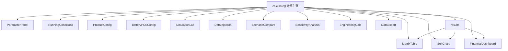
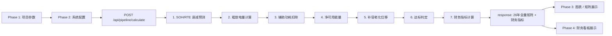

# BESS 业务流程优化 — 技术设计

Feature Name: bess-business-flow-optimization
Updated: 2026-06-27

## Description

将现有 BESS SOH 仿真系统从功能堆砌型重构为项目设计评估流程型。核心变更：
1. 导航架构从"首页/基础层/方案层/工具"重构为五阶段项目流程
2. 计算引擎统一到后端 `/api/pipeline/calculate`
3. 引入 Pinia 状态管理替代 App.vue props/events 传递
4. 现有约 20 个组件按功能归属迁移到对应 Phase

## Architecture

### 重构前架构



### 重构后架构

```mermaid
graph TD
    R["Vue Router"]
    R --> P1["Phase1Page (项目立项)"]
    R --> P2["Phase2Page (系统设计)"]
    R --> P3["Phase3Page (性能分析)"]
    R --> P4["Phase4Page (经济评估)"]
    R --> P5["Phase5Page (成果输出)"]
    P1 --> S1_1["SurveyForm"]
    P1 --> S1_2["RunningConditions (选址/电网)"]
    P2 --> S2_1["ProductConfig"]
    P2 --> S2_2["BatteryDCDesign"]
    P2 --> S2_3["PcsACDesign"]
    P2 --> S2_4["BatteryPCSConfig"]
    P3 --> S3_1["SimulationLab"]
    P3 --> S3_2["DataInjection"]
    P3 --> S3_3["MatrixTable"]
    P3 --> S3_4["SohChart"]
    P3 --> S3_5["ScenarioCompare"]
    P4 --> S4_1["FinancialDashboard"]
    P4 --> S4_2["SensitivityAnalysis"]
    P4 --> S4_3["EngineeringCalc"]
    P4 --> S4_4["AuxPowerCalculator"]
    P5 --> S5_1["ReportPage (技术报告)"]
    P5 --> S5_2["BomPage (设备清单)"]
    P5 --> S5_3["DataExport"]

    Store["Pinia Store (bessStore)"]
    Store --> P1
    Store --> P2
    Store --> P3
    Store --> P4
    Store --> P5

    API["POST /api/pipeline/calculate"]
    P3 --> API
    P4 --> API
```



### 统一计算管道



## Components and Interfaces

### 前端路由与组件分配

| 路由 | Phase 页面 | 子步骤 | 现有组件 | 变更 |
|------|-----------|--------|----------|------|
| `/phase1` | Phase1Page.vue | 1.1 项目调研表 | SurveyForm.vue | 迁移 |
| | | 1.2 选址资源评估 | RunningConditions.vue | 迁移(提取选址/电网部分) |
| | | 1.3 需求确认 | 内联 | 新增 |
| `/phase2` | Phase2Page.vue | 2.1 设备选型库 | ProductConfig.vue | 迁移 |
| | | 2.2 直流侧设计 | BatteryDCDesign.vue | 迁移 |
| | | 2.3 交流侧设计 | PcsACDesign.vue | 迁移 |
| | | 2.4 系统集成配置 | BatteryPCSConfig.vue | 迁移 |
| `/phase3` | Phase3Page.vue | 3.1 衰减预测 | SimulationLab.vue | 迁移，输出接入 store |
| | | 3.2 容量对账 | MatrixTable.vue | 迁移 |
| | | 3.3 可视化分析 | SohChart.vue | 迁移 |
| | | 3.4 多场景对比 | ScenarioCompare.vue | 迁移 |
| `/phase4` | Phase4Page.vue | 4.1 投资估算 | 新增 CAPEX 表单 | 新增 |
| | | 4.2 运营模型 | 新增 OPEX 表单 | 新增 |
| | | 4.3 收入模型 | FinancialDashboard.vue | 迁移(收入部分) |
| | | 4.4 财务指标 | FinancialDashboard.vue | 迁移(指标部分) |
| | | 4.5 敏感性分析 | SensitivityAnalysis.vue | 迁移 |
| `/phase5` | Phase5Page.vue | 5.1 技术报告 | ReportPage (新) | 整合 report API |
| | | 5.2 设备清单 | BomPage (新) | 整合 bom API |
| | | 5.3 数据导出 | DataExport.vue | 迁移 |
| `/` | HomePage.vue | 流程总览 | 重构 | 展示五阶段进度 + 项目列表 |

### Pinia Store 设计

```javascript
// stores/bess.js
export const useBessStore = defineStore('bess', {
  state: () => ({
    // Phase 1 - 项目信息
    project: {
      id: null,
      name: '',
      status: 'draft',
    },
    survey: { /* 调研表全字段 */ },

    // Phase 2 - 系统配置
    systemParams: {
      ratedEnergy: 5,
      initContainerQty: 10,
      initPcsQty: 2,
      pcsPower: 5,
      duration: 2,
    },
    selectedProducts: {
      cell: null,
      container: null,
      pcs: null,
    },

    // Phase 3 - 性能数据 (26年序列)
    degradation: {
      soh: new Array(NUM_YEARS).fill(0),
      rte: new Array(NUM_YEARS).fill(0),
      dod: new Array(NUM_YEARS).fill(100),
      augQty: new Array(NUM_YEARS).fill(0),
    },
    results: {
      initGross: [], initAux: [], initAcUsable: [],
      augGross: [], augAux: [], augAcUsable: [],
      augAccumQty: [], totalAcUsable: [], meetsReq: [],
    },

    // Phase 4 - 经济数据
    financial: {
      capex: {}, opex: {}, revenue: {},
      metrics: { npv: 0, irr: 0, lcoe: 0, lcos: 0, roi: 0, dscr: 0, payback: 0 },
    },

    // Phase 5 - 导出状态
    exports: { reportGenerated: false, bomGenerated: false },

    // UI 状态
    phases: {
      phase1: { status: 'pending' },
      phase2: { status: 'pending' },
      phase3: { status: 'pending' },
      phase4: { status: 'pending' },
      phase5: { status: 'pending' },
    },
  }),

  getters: {
    // 从 survey 提取仿真默认参数
    simulationDefaults: (state) => ({
      duration: state.survey.duration || 2,
      cyclesPerDay: state.survey.cyclesPerDay || 1,
      requiredEnergy: state.survey.requiredEnergy || 240,
      temperature: state.survey.temperature || 25,
    }),
  },

  actions: {
    // 更新某阶段参数，自动标记该阶段为 completed
    updatePhaseParams(phase, params) { /* ... */ },

    // 调用统一计算管道
    async runPipeline() {
      const res = await fetch('/api/pipeline/calculate', {
        method: 'POST',
        body: JSON.stringify({
          systemParams: this.systemParams,
          degradation: this.degradation,
          financial: this.financial,
        }),
      });
      const data = await res.json();
      this.results = data.results;
      this.financial.metrics = data.financial;
    },
  },
});
```

## Data Models

### 统一计算 API 请求/响应

```typescript
// POST /api/pipeline/calculate
interface PipelineRequest {
  // Phase 1+2 系统参数
  systemParams: {
    ratedEnergy: number;      // 单集装箱额定能量 (MWh)
    initContainerQty: number; // 初始集装箱数量
    initPcsQty: number;       // 初始 PCS 数量
    pcsPower: number;         // 单台 PCS 功率 (MW)
    duration: number;         // 储能时长 (h)
    cyclesPerDay: number;     // 每日循环次数
    temperature: number;      // 环境温度 (°C)
    acEfficiency: number;     // 交流效率 (%)
    bessAuxRun: number;       // BESS 运行辅耗 (kW)
    bessAuxStandby: number;   // BESS 待机辅耗 (kW)
    pcsAuxRun: number;        // PCS 运行辅耗 (kW)
    pcsAuxStandby: number;    // PCS 待机辅耗 (kW)
    requiredEnergy: number;   // 需求能量 (MWh)
  };

  // Phase 3 可选的用户覆写数据
  degradation?: {
    soh?: number[];    // 如不提供则后端用 Arrhenius 模型计算
    rte?: number[];    // 如不提供则后端按默认曲线
    dod?: number[];    // 默认全 100
    augQty?: number[]; // 补容策略
  };

  // 算法选择
  algorithm?: {
    model: 'arrhenius' | 'empirical' | 'hybrid';
    correctionFactor?: number;
    correctionTable?: Record<number, number>;
  };

  // Phase 4 财务参数
  financial?: {
    capex: { /* 投资明细 */ };
    opex: { /* 运营成本明细 */ };
    revenue: { /* 收入模型参数 */ };
  };
}

interface PipelineResponse {
  // 26 个元素的序列数组
  years: number[];          // [0, 1, ..., 25]
  soh: number[];            // SOH 衰减率 (%)
  rte: number[];            // RTE 效率 (%)
  dod: number[];            // DOD 放电深度 (%)
  initGross: number[];      // 存量资产粗放电量
  initAux: number[];        // 存量资产辅耗
  initAcUsable: number[];   // 存量资产净可用
  augGross: number[];       // 补容资产粗放总和
  augAux: number[];         // 补容资产辅耗
  augAcUsable: number[];    // 补容资产净可用
  augAccumQty: number[];    // 累计补容数量
  totalAcUsable: number[];  // 总净可用
  meetsReq: boolean[];      // 是否满足需求

  // 财务指标
  financial: {
    npv: number;
    irr: number;
    lcoe: number;
    lcos: number;
    roi: number;
    dscr: number;
    payback: number;  // 投资回收期 (年)
  };
}
```

### 计算管道顺序（后端实现）

```
1. 输入校验 (validate_pipeline_input)
2. 温度转换 (celsius → kelvin)
3. IF 用户未提供 SOH:
     → Arrhenius 模型计算 SOH 衰减
     → 计算 RTE 衰减
4. 对每一年 i (0-25):
     a. 存量资产评估:
        initGross[i] = ratedEnergy × containerQty × DOD[i] × RTE[i] × SOH[i] × acEfficiency
        initAux[i] = containerQty × cycleAux + pcsQty × cyclePcsAux
        initAcUsable[i] = max(0, initGross[i] - initAux[i])
     b. 补容资产流追踪 (老化位移模型):
        遍历 j=0..i, 对每年补容 augQty[j]:
          age = i - j
          soh_offset = SOH[age]
          augAcUsable += augQty[j] × ratedEnergy × DOD[i] × RTE[i] × soh_offset × acEfficiency
     c. totalAcUsable[i] = initAcUsable[i] + augAcUsable[i]
     d. meetsReq[i] = totalAcUsable[i] >= requiredEnergy
5. IF 用户请求财务指标:
     基于 totalAcUsable 和 financial 参数计算 NPV/IRR/LCOS/DSCR/ROI
6. 返回 PipelineResponse
```

## Error Handling

| 场景 | 处理策略 |
|------|---------|
| 输入参数范围非法 | 返回 400 + `{error, field, value, constraint}` |
| 计算超时（>10s） | 返回 202 + `{taskId}`，前端轮询 `GET /api/pipeline/task/{taskId}` |
| 重复提交（3秒内相同参数） | 取消前一个未完成任务，执行最新请求 |
| 后端计算异常 | 返回 500 + `{error, detail}`，前端显示错误 Toast |
| 网络不可达 | 前端显示"后端服务不可用"错误横幅，保留本地已计算的数据 |
| 数据库写入失败 | 报告生成失败时返回 500，前端提示用户重试，不丢失前端状态 |

## Test Strategy

| 层级 | 测试内容 | 框架 |
|------|---------|------|
| 后端单元 | 计算管道的每一步独立可测：Arrhenius 计算、容量对账、补容位移、财务指标 | pytest |
| 后端集成 | `POST /api/pipeline/calculate` 端到端响应正确性；参数校验行为 | pytest |
| 前端单元 | Pinia store actions/getters 逻辑；PhasePage 组件渲染 | vitest |
| 前端集成 | 五阶段流程串联：填调研表→选型→计算→查看结果→导出 | Playwright |
| 回归 | 现有 `/api/soh/calculate`、`/api/health`、`/api/upload/extract` 行为不变 | pytest |

## References

[^1]: (.monkeycode/specs/bess-business-flow-optimization/requirements.md) - 需求文档
[^2]: (docs/SRS.md) - 现有软件需求规格说明书
[^3]: (docs/Algorithm-Design.md) - 阿伦尼乌斯算法设计文档
[^4]: (docs/PHASE1-DESIGN.md) - 第一波设计与需求规格
[^5]: (docs/Development-Plan.md) - 开发计划
[^6]: (soh-sim-backend/app.py) - 现有后端入口与计算逻辑
[^7]: (soh-sim-frontend/src/App.vue) - 现有前端中心调度器
